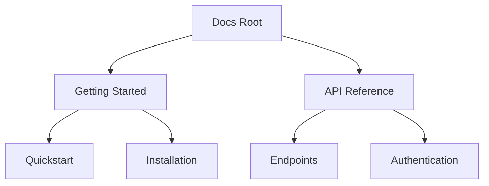

## Overview

Silly Smile provides powerful tools to streamline your documentation workflow. You organize content into hierarchical structures, edit with intuitive tools, search efficiently, and track changes with version control. These features help you maintain clear, up-to-date docs for your projects.

<Columns cols={3}>
  <Card title="Document Hierarchy" icon="layout" href="#document-organization">
    Build nested folders and pages effortlessly.
  </Card>
  <Card title="Editing Tools" icon="edit-3" href="#editing-tools">
    Format content with rich editors.
  </Card>
  <Card title="Search & Navigation" icon="search" href="#search-navigation">
    Find information quickly across your docs.
  </Card>
</Columns>

## Document Organization and Hierarchy

Create a logical structure for your documentation using folders and subpages. You nest pages to reflect your project's architecture, making navigation intuitive.

<Steps>
  <Step title="Create a Folder" icon="folder">
    Click the new folder button in the sidebar.
    
    Select a parent folder for nesting.
  </Step>
  <Step title="Add Pages" icon="file-text">
    Right-click a folder and select "New Page".
    
    Name your page descriptively.
  </Step>
  <Step title="Reorder" icon="move">
    Drag pages or folders to adjust hierarchy.
  </Step>
</Steps>



<Callout kind="tip">
  Use descriptive names for folders to improve discoverability.
</Callout>

## Editing and Formatting Tools

Silly Smile offers flexible editing options. Choose Markdown for precision or a visual editor for speed.

<Tabs>
  <Tab title="Markdown Editor" icon="code">
    Write structured content with familiar syntax.
    
````markdown
# Heading

**Bold text** and _italics_.

- List item
- Another item

`Inline code` for variables.
````
  </Tab>
  <Tab title="Visual Editor" icon="edit">
    Drag-and-drop elements like images and callouts.
    
    Preview changes in real-time without syntax worries.
  </Tab>
</Tabs>

<CodeGroup tabs="Markdown,HTML">
```markdown
## Features

| Feature | Description |
|---------|-------------|
| Search  | Full-text   |
| Edit    | Rich tools  |
```
```html
<h2>Features</h2>
<table>
  <tr><th>Feature</th><th>Description</th></tr>
  <tr><td>Search</td><td>Full-text</td></tr>
  <tr><td>Edit</td><td>Rich tools</td></tr>
</table>
```
</CodeGroup>

## Search and Navigation Functionalities

Locate content instantly with full-text search. Navigation uses breadcrumbs and a dynamic sidebar.

| Feature       | How It Works                  |
|---------------|-------------------------------|
| Global Search | Type keywords to find pages   |
| Filters       | Narrow by folder or tags      |
| Breadcrumbs   | Track your location in hierarchy |

<Callout kind="info">
  Pin frequently used pages to the top of the sidebar for quick access.
</Callout>

## Version Control Basics

Track changes to your docs with built-in versioning. You commit snapshots and revert if needed.

<Expandable title="Advanced Version Workflow" default-open="false">
  Integrate with Git for deeper control.
  
````bash
git add docs/
git commit -m "Update features page"
git push origin main
````
</Expandable>

<CodeGroup tabs="Commit,Revert">
```bash
# Commit changes
silly-smile commit -m "Add search improvements"
```
```bash
# Revert to previous version
silly-smile revert --version v1.2.3
```
</CodeGroup>

These core features empower you to manage professional documentation efficiently. Explore further with [Quickstart](/quickstart).